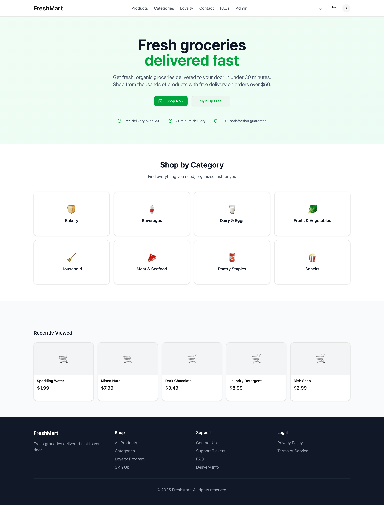
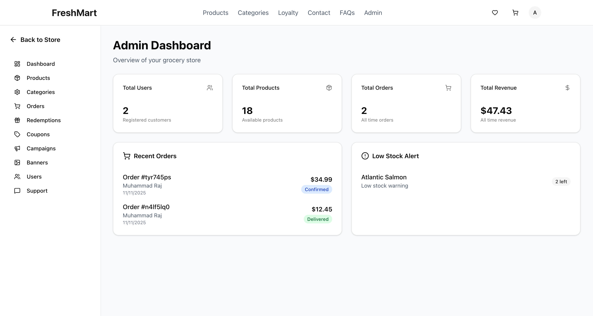
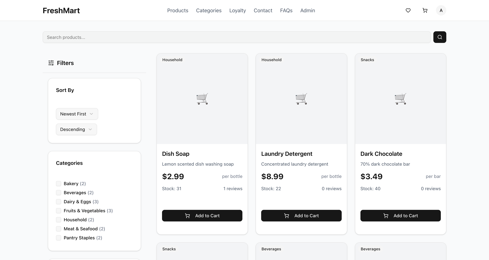
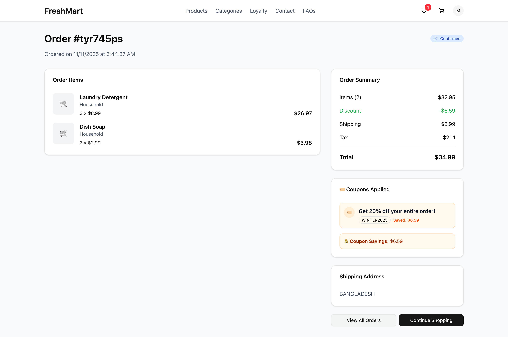
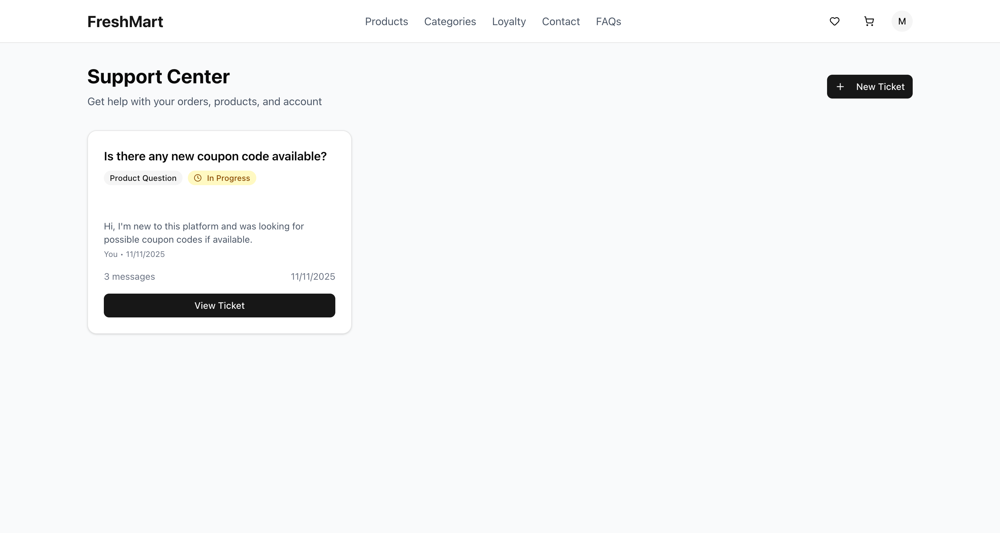

# FreshMart

<div align="center">

# Modern Enterprise Grocery Platform

_A complete e-commerce solution with advanced loyalty programs, analytics, and comprehensive admin tools_



</div>

> **For viewing all features with detailed screenshots, visit the [Showcase Page](https://freshmart.hexraj.com/showcase)**

---

## 📋 Overview

FreshMart is a modern, full-featured online grocery platform built with cutting-edge web technologies. It combines seamless customer experiences with powerful business intelligence tools, making it perfect for grocery retailers competing in today's digital marketplace.

## ✨ Key Features

### 🛍️ Customer Experience

- **Advanced Product Discovery** — Full-text search with intelligent filtering
- **Smart Shopping Cart** — Persistent cart with real-time calculations
- **Order Tracking** — 6-stage delivery pipeline with notifications
- **Product Reviews** — Verified rating system with customer feedback
- **Wishlist Management** — Save and share favorite products

### 🎁 Loyalty & Rewards

- **4-Tier Rewards Program** — Bronze → Silver → Gold → Platinum progression
- **Points System** — Earn 10 points per dollar with campaign multipliers
- **Referral Program** — Bonus points for inviting friends

### 🛠️ Admin Control Center

- **Business Intelligence** — Real-time KPIs and analytics dashboard
- **Product Management** — Complete inventory control with bulk operations
- **Order Fulfillment** — 6-stage processing pipeline with automated updates
- **Customer Support** — Multi-priority ticketing system with chat messaging
- **Marketing Tools** — Dynamic campaigns, coupons, and banner management

## 📸 Screenshots

<div align="center">

### Admin Dashboard


_Business intelligence dashboard with real-time KPIs and analytics_

### Product Management


_Advanced product catalog with search and filtering capabilities_

### Order Management


_Comprehensive order tracking with detailed status updates_

### Customer Support


_Multi-priority ticketing system with chat messaging_

</div>

## 🏗️ Technology Stack

| Category               | Technologies                                             |
| ---------------------- | -------------------------------------------------------- |
| **Frontend**           | Next.js 16, React 19, TypeScript, Tailwind CSS, Radix UI |
| **Backend**            | Next.js API Routes, Prisma ORM, PostgreSQL               |
| **Authentication**     | NextAuth.js with JWT sessions                            |
| **Forms & Validation** | React Hook Form + Zod                                    |

## 🚀 Quick Start

### Prerequisites

- Node.js 20+
- PostgreSQL database
- Git

### Installation

```bash
# Clone repository
git clone https://github.com/iamajraj/freshmart.git
cd freshmart

# Install dependencies
npm install

# Setup environment
cp .env.example .env.local
# Configure your DATABASE_URL and NEXTAUTH_SECRET

# Setup database
npm run postinstall
npm run db:push
npx tsx prisma/seed.ts admin@admin.com YOUR_ADMIN_PASSWORD

# Start development server
npm run dev
```

Visit [http://localhost:3000](http://localhost:3000) to explore the platform.

---

## 👨‍💻 Author

**Muhammad Raj**

- GitHub: [@iamajraj](https://github.com/iamajraj)
- LinkedIn: [Muhammad Raj](https://linkedin.com/in/hexraj)

---
